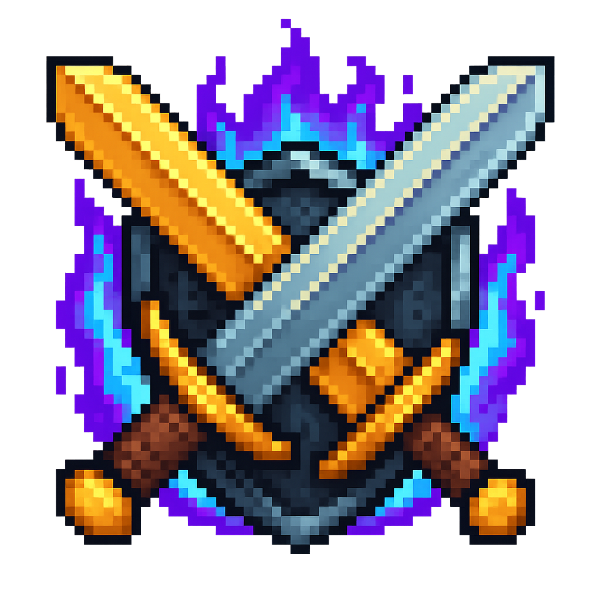

# Simple PvP

A powerful desktop application for managing PvP activities in Simple MMO. Built with Electron and Vue.js, Simple PvP provides an intuitive interface for optimal mass PvP.

## ✨ Features

### 🎯 **Target Management**
- **Smart Target Generation**: Automatically fetch and queue targets based on your level preferences
- **Level Filtering**: Set minimum and maximum level ranges for optimal target selection

### ⚔️ **Combat System**
- **Spacebar Attack**: Press spacebar to attack the current target and automatically move to the next
- **Event Logging**: Real-time event tracking showing all your attacks interactions

### 🏰 **Guild War Management**
- **War List Display**: View all active guild wars with kill counts and statistics
- **Guild Sorting**: Sort wars by kills

### ⚙️ **Configuration**
- **API Integration**: Secure connection to Simple MMO using your personal API key
- **Persistent Settings**: All preferences and data stored locally and persist between sessions
- **Customizable Keybinds**: Remap keyboard shortcuts to your preference
- **Modern UI**: Clean, responsive interface

## 🚀 Quick Start

### Prerequisites
- Windows 10/11 (primary support)
- SimpleMMO account with API access
- Internet connection for API communication

### Installation

1. **Download the latest release** from the [Releases](https://github.com/osiandtrix/simple-pvp/releases) page
2. **Run the installer** - it will automatically install over previous versions
3. **Launch Simple PvP** from your desktop or start menu
4. **Enter your API key** when prompted:
   - Visit [Simple MMO API page](https://web.simple-mmo.com/p-api/home)
   - Copy your personal API key
   - Paste it into Simple PvP and click "Connect & Validate"

### First Use

1. **Configure Level Ranges**: Set your preferred minimum and maximum target levels
2. **Load Guild Wars**: The app will automatically fetch your guild's active wars
3. **Start Combat**: Click "Enter Combat" to begin your PvP session
4. **Use Spacebar**: Press spacebar to attack targets and advance through your queue

## 🎮 Primary Controls

| Key | Action |
|-----|--------|
| `Spacebar` | Attack current target and move to next |
| `Ctrl + Space` | Go back to previous target |

*All keybinds can be customized in Settings*

## 🔗 Future Integration

Simple PvP is designed to work seamlessly with the upcoming **Simple Companion** web application.  Stay tuned for updates!

## 📊 Data Storage

All your data is stored locally and securely:
- **API Key**: Encrypted and stored in local SQLite database
- **Settings**: Level preferences, keybinds, and UI preferences
- **Combat Data**: Attack logs, target history, and session statistics
- **Guild Wars**: Cached war data for offline access

## 📝 License

This project is licensed under the MIT License - see the [LICENSE](LICENSE) file for details.

## 🆘 Support

- **Simple Companion**: Follow updates and report issues on [Discord](https://discord.gg/zBbJ7QuK3U)

---

**Made with ❤️ for the SimpleMMO community**
